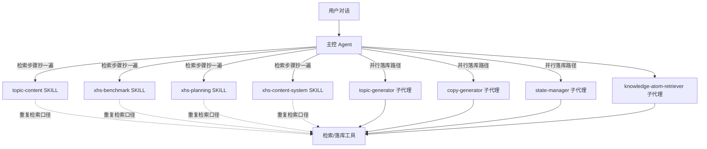
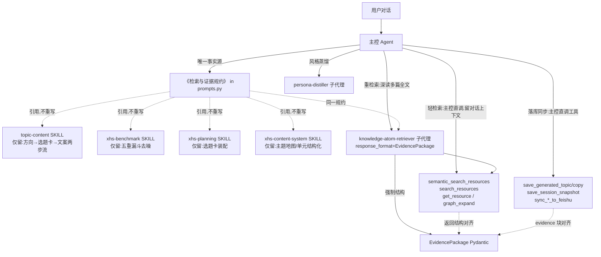

# Design Document: retrieval-flow-consolidation(检索流程收敛与职责统一)

## Overview

本 spec 是一次**纯结构重构**:把"检索 / 取证 / 落库 / 同步"在四个创作技能里各抄一遍、又与子代理并行的检索逻辑,收敛为**单一事实源**,并按 deepagents 0.6.10 官方三层原语(工具 / 技能 / 子代理)重新对齐职责边界。它**不改动相关性算法**——中文查询前缀、绝对相关度闸门、去归一化重排已由 `retrieval-relevance-overhaul` 上线,本 spec 只动提示词/技能/子代理文本 + 新增一个 Pydantic schema。

三件落地物:(1) 在 `prompts.py` 主控系统提示新增《检索与证据规约》一节,作为统一检索顺序、`insufficient_relevance` 处理、`EvidencePackage` 字段、时效/防伪的**唯一事实源**;(2) 四个创作技能(`topic-content`、`xhs-benchmark`、`xhs-planning`、`xhs-content-system`)删除各自重抄的检索步骤,改为引用主控规约,仅保留差异化工作流;(3) 定义 `EvidencePackage` Pydantic 模型,供 `knowledge-atom-retriever` 子代理 `response_format` 强制输出,并与检索工具返回结构、`xhs_topics`/`xhs_copy` 的 evidence 块对齐。

连带决策:**移除** `topic-generator`/`copy-generator`/`state-manager` 三个 thin 持久化子代理(它们只是 `save_*` + `sync_*` 两次工具调用,不符合"复杂/多步/需隔离上下文"的子代理定位),职责收回主控技能用工具直调。子代理仅保留 `knowledge-atom-retriever`(重检索)与 `persona-distiller`(风格蒸馏)。运行时约束决定落点:部署的 deepagents 运行时只见 `prompts.py` + 各 `SKILL.md` + subagents 提示,`.kiro/steering` 不进入运行时,故规约只能落在 `prompts.py`。

## Architecture

### 改动前(漂移态)



### 改动后(收敛态)



### 三层原语职责对齐(官方依据)

| 原语 | 本质 | 本 spec 中的角色 |
|---|---|---|
| **工具 Tool** | 一次确定性 I/O,返回值即固定结构,可在调用间隙与用户交互 | 全部检索动作 + `save_*`/`sync_*` 落库同步;主控直调 |
| **技能 Skill** | 注入主控的工作流(SKILL.md,渐进式披露),保证不了格式 | 仅保留各自差异化工作流;检索/取证一句话引用主控规约 |
| **子代理 task** | 无状态、隔离上下文、`response_format` 可强制格式、中途不可交互 | 仅 `knowledge-atom-retriever`(重检索)+ `persona-distiller`(蒸馏) |

判据(钉死):需要执行动作 → 工具;需要保证固定返回格式 → 工具返回结构或子代理 `response_format`;要与用户来回/保持对话上下文 → 主控技能 + 工具直调;单次要灌进 LLM 的全文量很大、可隔离只取结论 → 子代理 + `response_format`。

**决策点(操作性,必须明确)**:轻/重不在检索前预判(检索前不知要深读几篇)。统一为——**主控总是先做轻量语义检索(semantic_search_resources)拿候选**;拿到候选后评估:若**只需摘要 + 精读少量(≤ 约 5 篇)** → 主控直接 `get_resource` 内联完成(轻);若**需精读大量全文跨多源综合**才能定 → 此时才委派 `knowledge-atom-retriever`(重)。即委派判断发生在**初次语义检索之后**,不在之前;切换信号是 per-query 的"候选深读量",不是语料库规模。

## Data Flow:统一标准检索流程

```mermaid
sequenceDiagram
    participant U as 用户
    participant M as 主控 Agent(按《检索与证据规约》)
    participant SS as semantic_search_resources
    participant FT as search_resources(Meili)
    participant GR as get_resource
    participant GE as graph_expand
    participant KAR as knowledge-atom-retriever

    U->>M: 帮我出 X 方向的选题
    M->>SS: ① 语义优先 semantic_search_resources(query, top_k)
    alt mode = semantic
        SS-->>M: top-N 相关摘要
        M->>FT: ② 关键词补充(仅语义结果偏少/关键词很明确)
        FT-->>M: 补召摘要
        M->>GR: ③ 精读 get_resource × top-N(N 小)
        GR-->>M: 全文
        opt 需衍生/效果邻域
            M->>GE: ④ graph_expand(resource_ids, hops=1)
            GE-->>M: derived_from / measured_by / same_author 邻域
        end
        opt N 很大,需深读多篇
            M->>KAR: 委派重检索(隔离上下文)
            KAR-->>M: EvidencePackage(只回小证据包)
        end
        M-->>U: ⑤ 产出 EvidencePackage + xhs_topics/xhs_copy
    else mode = insufficient_relevance
        SS-->>M: results=[], top_score < threshold
        M-->>U: 明说"当前数据不足",建议 sync_feishu_resources;不降级、不编造
    else mode = keyword_fallback
        SS-->>M: 语义引擎不可用,已退 Meili 全文
        M-->>U: 可用其 results,标注为降级结果
    end
```

顺序定稿:**语义优先,全文补充**。语义召回是主路径(经中文前缀 + 绝对相关度闸门),全文是补充/降级;不再保留"先关键词打底"的并行写法。图扩展是**条件触发的证据增强**(非默认每次走、非可删),触发条件=需要候选的衍生/效果邻域。

> ⚠️ **范围依赖说明**:`graph_expand` 的有效性依赖图中存在关联边,而 `same_author`/`shares_tag` 等关联边属于**另一条独立主线(草案 §8 内容关联与效果增强),不在本 spec 范围**。当前线上图仅 7 条 `derived_from` 边(创作血缘),故本 spec 落地后 `graph_expand` 仍近乎返回空——这是预期的,本 spec 只把它**保留为规约里的条件触发步骤**(占位 + 不删能力),其实际产出待 §8 落地后释放。本 spec 不因图稀疏而移除该步,也不承诺其当下产出。

## Components and Interfaces

### Component 1: 《检索与证据规约》(prompts.py 主控系统提示新增节)

**Purpose**:统一检索顺序、`insufficient_relevance` 处理、`EvidencePackage` 字段、时效/防伪规约的唯一物理落点。每轮必在上下文,是天然单一源。

**要点(规约内容)**:
- **检索顺序**:① 语义优先 `semantic_search_resources` → ② 关键词补充 `search_resources`(条件) → ③ 精读 `get_resource` × top-N → ④ 图增强 `graph_expand`(条件触发) → ⑤ 产出 `EvidencePackage`。
- **mode 三态处理**:`semantic`=正常用;`insufficient_relevance`=明说"当前数据不足"、建议同步、不降级凑、不编造;`keyword_fallback`=可用但标注降级。
- **飞书是上游补给**:创作只检索 Postgres;数据不足才 `sync_feishu_resources` 同步后重检索;同步后仍无 → 明说数据不足。
- **EvidencePackage 字段**:`retrieval_mode` / `evidence[]`(`resource_id`/`title`/`summary`/`source_updated_at`/`indexed_at`/`score`/`why_selected`)/ `gaps`。
- **时效/防伪**:`source_updated_at`(源端)与 `indexed_at`(本地索引)严格区分;任一未知写"未知"不猜;数据不足明说不编造。
- **轻 vs 重**:轻检索主控直调工具(留对话上下文);重检索(深读多篇)委派 `knowledge-atom-retriever`。

**职责边界更新(prompts.py §1 枚举 + §3 委派规则,两处都要改)**:
- **§1"可用执行型 subagent"枚举**:删除 `topic-generator`/`copy-generator`/`state-manager` 三行,仅保留 `knowledge-atom-retriever` 与 `persona-distiller`。⚠️ 这是**必改项**——若只改 §3 而漏 §1,§1 仍点名已删除的子代理,形成**悬挂引用**(prompt 让 agent 调用不存在的 subagent)。
- **§3 委派规则**:删除对 `topic-generator`/`copy-generator`/`state-manager` 的委派条目;明确"主控自己调 `save_generated_topic`/`save_generated_copy`/`save_session_snapshot` + 对应 `sync_*_to_feishu`"。

### Component 2: 四个创作技能(引用而非重写)

**Purpose**:删除各自重抄的检索步骤,改为一句"按主控《检索与证据规约》执行检索与证据收集",仅保留差异化工作流。

| 技能 | 删除(重抄检索口径) | 保留(差异化工作流) | 落库同步改动 |
|---|---|---|---|
| `topic-content` | "工具边界与检索顺序"整节、检索 mode 重述、防伪/时效重述 | 方向→出选题卡→停下等用户选→写文案两步流、质量检查清单 | 落库/同步保持主控直调 `save_generated_topic`/`save_generated_copy`/`save_user_feedback`/`sync_*`(本就是工具) |
| `xhs-benchmark` | Phase 1 检索调用清单、"数据不足"重述 | 五重漏斗去噪、行级拆解、可复用规律总结 | 无落库,不涉及 |
| `xhs-planning` | Phase 1 检索调用清单、"数据不足"重述 | 爆款规律提炼、选题卡片装配 | Phase 4 保持主控直调 `save_generated_topic` + `sync_topic_to_feishu` |
| `xhs-content-system` | Phase 2/3 检索调用清单 | 底座审计、主题地图、内容单元结构化、选题装配 | 保持主控直调 `save_generated_topic`/`save_session_snapshot` + `sync_*` |

**约束**:改动后四个技能仍须满足路由契约测试——`description` frontmatter 保留 ≥2 个「」语义触发短语、无斜杠命令(frontmatter 与正文)、不手抄路由表。引用语写在正文,不得引入 `/xhs-*` 形态文本。

### Component 3: knowledge-atom-retriever 子代理(加 response_format)

**Purpose**:重检索(深读多篇全文)在隔离上下文里召回+精读+蒸馏,只回小证据包,格式由框架强制。

**Interface(子代理 dict 新增 key)**:
```python
{
    "name": "knowledge-atom-retriever",
    "description": "...",                 # 不变
    "system_prompt": "...",               # 引用同一《检索与证据规约》口径
    "model": initial_model,
    "tools": [semantic_search_resources, search_resources, graph_expand, get_resource],
    "response_format": EvidencePackage,   # 新增:框架强制结构化输出
    "middleware": [build_router_middleware(registry)],
}
```

### Component 4: 子代理注册表收敛

**Purpose**:移除 thin 持久化子代理,职责收回主控。

**Interface 改动(subagents_executor.py)**:
- `EXECUTOR_SUBAGENT_NAMES` 由 5 个收敛为 2 个:`{"knowledge-atom-retriever", "persona-distiller"}`。
- 删除 `build_topic_generator` / `build_copy_generator` / `build_state_manager` 三个工厂函数。
- `build_executor_subagents` 只返回 `[knowledge-atom-retriever, persona-distiller]`。
- `save_generated_topic`/`save_generated_copy`/`save_session_snapshot`/`sync_*_to_feishu` 仍是 `data_foundation/tools.py` 与 `tools/feishu_actions.py` 的工具,由主控直调;HITL 由 `interrupt_on` 在工具层保证,不受影响。

## Data Models

### EvidencePackage(新增 Pydantic 模型)

> **边界澄清**:`EvidencePackage` 是**"检索步骤的证据产出契约"**,不是各创作技能的**最终输出格式**。`xhs-benchmark` 仍出"去噪报告/行级拆解"、`xhs-content-system` 仍出"主题地图/单元清单"——它们**消费**证据包做各自分析,**不**以 EvidencePackage 作为自身最终产物。EvidencePackage 强约束只作用于:`knowledge-atom-retriever` 的 response_format + 检索工具返回结构 + `xhs_topics`/`xhs_copy` 的 evidence 块。

放置位置建议:`data_foundation/evidence.py`(新文件)。`data_foundation/models.py` 现为 `@dataclass(frozen=True)` 风格,而 `response_format` 需要 Pydantic;为不混淆两套风格,单列文件承载证据契约的 Pydantic 模型。deepagents 已依赖 pydantic,**无新依赖**。

```python
from __future__ import annotations

from typing import Literal
from pydantic import BaseModel, Field

RetrievalMode = Literal["semantic", "keyword_fallback", "insufficient_relevance"]


class EvidenceItem(BaseModel):
    """单条证据。字段口径与检索工具返回结构、xhs_topics/xhs_copy 的 evidence 块对齐。"""
    resource_id: str
    title: str
    summary: str
    source_updated_at: str = Field(description="源端更新时间;未知写\"未知\",不得猜测或伪造")
    indexed_at: str = Field(description="本地索引时间;未知写\"未知\",不得猜测或伪造")
    score: float = Field(description="绝对相关度(cosine)或 bm25 归一化分")
    why_selected: str = Field(description="为何选它。**沿用现有工具/前端既有字段名 `why_selected`,不引入新名 why_relevant**,以免破坏 EvidenceInspector/types.ts 渲染契约")


# 字段映射(实现必读):
#   - 工具(search_resources/semantic_search_resources)返回里 source_updated_at/indexed_at 嵌在 results[].metadata 内,
#     而 EvidenceItem 与前端 types.ts 一样置于**顶层** → 组装时需从 metadata 提平。
#   - why_selected 由排序服务(rank_evidence)产出,字段名一致,直取。


class EvidencePackage(BaseModel):
    """统一证据包。knowledge-atom-retriever 的 response_format;检索工具/最终 evidence 块对齐它。"""
    retrieval_mode: RetrievalMode
    evidence: list[EvidenceItem] = Field(default_factory=list)
    gaps: str | None = Field(
        default=None,
        description="数据不足/缺什么;retrieval_mode == 'insufficient_relevance' 时必填",
    )
```

**Validation Rules**:
- `retrieval_mode` 必须 ∈ {`semantic`, `keyword_fallback`, `insufficient_relevance`}。
- `retrieval_mode == "insufficient_relevance"` ⟹ `evidence == []` 且 `gaps` 非空(明说数据不足)。
- `retrieval_mode == "semantic"` 且 `evidence` 非空 ⟹ 每条 `evidence` 的 `resource_id` 非空。
- `source_updated_at`/`indexed_at` 恒为字符串;未知写字面量 `"未知"`,从不省略字段、从不输出 `updated_at` 作替代。
- `score` 为 float;`semantic` 模式下为绝对余弦,`keyword_fallback` 下为 bm25 归一化分。

### 三处复用映射(口径统一)

| 复用点 | 来源 | 字段对齐方式 |
|---|---|---|
| 检索工具返回 | `semantic_search_resources` / `search_resources` 的 `results[]` | `resource_id/title/summary/score/why_selected` 直取;`source_updated_at`/`indexed_at` 从 `metadata` 提平到顶层 |
| 子代理 response_format | `knowledge-atom-retriever` | 框架强制返回 `EvidencePackage` |
| 最终 evidence 块 | `xhs_topics` / `xhs_copy` 的 `evidence` | 字段子集对齐(`resource_id/title/summary/source_updated_at/indexed_at`),不破坏前端渲染契约 |

## Key Functions with Formal Specifications

### Function 1: build_knowledge_atom_retriever()

```python
def build_knowledge_atom_retriever(
    registry: ModelPoolProvider,
    initial_model: BaseChatModel,
    backend: Any = None,
) -> dict
```

**Preconditions**:
- `EvidencePackage` 已定义且为 `pydantic.BaseModel` 子类。
- 检索工具 `semantic_search_resources`/`search_resources`/`graph_expand`/`get_resource` 已导入。

**Postconditions**:
- 返回 dict 含 `"response_format": EvidencePackage`。
- 返回 dict 的 `"name" == "knowledge-atom-retriever"`。
- `system_prompt` 不再内联完整检索口径副本,改为引用主控规约(检索顺序/mode/防伪与 prompts.py 一致)。
- 无副作用(纯构造)。

### Function 2: build_executor_subagents()

```python
def build_executor_subagents(
    registry: ModelPoolProvider,
    initial_model: BaseChatModel,
    backend: Any = None,
) -> list[dict]
```

**Preconditions**:
- `build_knowledge_atom_retriever`、`build_persona_distiller` 可调用。

**Postconditions**:
- 返回列表恰含 2 个子代理,`{a["name"] for a in result} == {"knowledge-atom-retriever", "persona-distiller"}`。
- 返回的 name 集合 == `EXECUTOR_SUBAGENT_NAMES`(保持 `test_build_executor_subagents_returns_declared_names` 绿)。
- 不含 `topic-generator`/`copy-generator`/`state-manager`。

**Loop Invariants**:N/A。

### Function 3: EvidencePackage 校验(框架侧)

```python
def validate_evidence_package(raw: dict) -> EvidencePackage
```

**Preconditions**:
- `raw` 是子代理 LLM 产出的结构化输出(由 `response_format` 触发)。

**Postconditions**:
- 成功 ⟹ 返回的 `EvidencePackage` 满足上述 Validation Rules。
- `retrieval_mode == "insufficient_relevance"` ⟹ `gaps is not None and evidence == []`。
- 字段缺失或 `retrieval_mode` 非法 ⟹ 抛 `ValidationError`(框架重试/报错,不静默放过)。

## Algorithmic Pseudocode:统一标准检索流程(规约语义)

> ⚠️ **执行模型澄清(实现必读)**:下方 `standard_retrieval(...) -> EvidencePackage` 是**规约语义的伪代码表达**,**不是要落地的一个 Python 编排函数**。
> - **轻量路径(主路径)**:由主控 LLM**遵循 prompts.py 的《检索与证据规约》**逐步调工具完成,EvidencePackage 在此是 prompt 描述的目标格式,属**软约束**(LLM 尽力遵循),无 Pydantic 强制。
> - **重检索路径**:委派 `knowledge-atom-retriever` 子代理,其 `response_format=EvidencePackage` 由框架**硬强制**结构化输出。
> 即:EvidencePackage 作为 Pydantic 模型**只在子代理路径被框架强制**;轻量路径靠规约 + 最终 `xhs_topics`/`xhs_copy` 的 evidence 块对齐。实现时不要去写一个并不存在的 `standard_retrieval` 编排函数。


```python
def standard_retrieval(query: str, top_k: int) -> EvidencePackage:
    # ① 语义优先
    res = semantic_search_resources(query, top_k=top_k)

    if res["mode"] == "insufficient_relevance":
        # 库内无足够相关内容:明说数据不足,不降级、不编造
        return EvidencePackage(
            retrieval_mode="insufficient_relevance",
            evidence=[],
            gaps="当前数据不足:库内无足够相关内容,建议 sync_feishu_resources 同步后重试",
        )

    if res["mode"] == "keyword_fallback":
        mode = "keyword_fallback"          # 语义引擎不可用,已退 Meili 全文(降级)
        hits = res["results"]
    else:
        mode = "semantic"
        hits = res["results"]
        # ② 关键词补充(条件:语义结果偏少或关键词非常明确)
        if len(hits) < MIN_SEMANTIC_HITS or query_is_very_specific(query):
            hits = merge_dedupe(hits, search_resources(query, limit=top_k)["results"])

    # ③ 精读 top-N(N 小);N 很大时整段交 knowledge-atom-retriever 隔离精读
    evidence = []
    for r in hits[:TOP_N]:
        body = get_resource(r["resource_id"])
        evidence.append(to_evidence_item(r, body, why_selected=explain(r, query)))

    # ④ 图增强(条件触发:需衍生/效果邻域时)
    if needs_derivation_or_performance_neighborhood(query):
        graph_expand([e.resource_id for e in evidence], hops=1)  # 结果并入依据

    # ⑤ 产出统一证据包
    return EvidencePackage(retrieval_mode=mode, evidence=evidence, gaps=None)
```

**Preconditions**:`query` 非空;检索工具可用(否则各自返回 `ok=False`,主控明说不可用)。
**Postconditions**:返回值满足 EvidencePackage Validation Rules;`insufficient_relevance` 时 `gaps` 必填、`evidence` 为空。
**Loop Invariants**:`evidence` 累积过程中每条均带非空 `resource_id` 与字符串化的 `source_updated_at`/`indexed_at`(未知写"未知")。

## Example Usage

```python
# 主控轻检索(留在对话上下文,可与用户交互、迭代换角度)——伪代码层级示意
pkg = standard_retrieval("露营装备", top_k=10)
if pkg.retrieval_mode == "insufficient_relevance":
    reply("当前数据不足,建议先同步飞书资源后再出选题。")   # 不编造
else:
    topics = assemble_topics(pkg.evidence)                  # topic-content 差异化工作流
    save_generated_topic(direction="露营装备", topics=topics, evidence=pkg.evidence)  # 主控直调工具
    sync_topic_to_feishu(direction="露营装备", topics=topics)                          # 主控直调工具

# 主控重检索委派(需深读多篇全文,隔离上下文,框架强制结构)
result = task(
    "knowledge-atom-retriever",
    "围绕'冷启动期账号定位'召回并精读相关历史素材,返回证据包",
)
assert isinstance(result, EvidencePackage)                  # response_format 强制
```

最终对用户展示时,evidence 块仍按 `xhs_topics`/`xhs_copy` 协议输出,字段与 `EvidenceItem` 对齐:

```json
{
  "topics": [
    {
      "topic_title": "选题名称",
      "evidence": {
        "resource_id": "资源ID",
        "title": "资源标题",
        "summary": "资源摘要",
        "source_updated_at": "未知",
        "indexed_at": "2026-06-25T..."
      }
    }
  ]
}
```

## Correctness Properties

### Property 1: 唯一事实源
检索顺序 / mode 处理 / 防伪规约的完整定义,在运行时载体中**只出现一次**(`prompts.py` 的《检索与证据规约》)。∀ skill ∈ {topic-content, xhs-benchmark, xhs-planning, xhs-content-system}:skill 正文不含 mode 三态的完整重述,只含对主控规约的一句引用。

> 注:本属性是**语义级不变量,靠 code review 保证**,难以机器断言("没有完整重述"无法可靠正则化)。Testing Strategy 不为其提供自动化测试;落地评审时人工核对四个技能不再重述检索 mode/防伪口径。可做的弱自动化兜底:断言四个技能正文不再出现 `insufficient_relevance`/`keyword_fallback` 等 mode 字面量(若约定规约措辞只在 prompts.py 出现)。

**Validates: Requirements 1.1, 1.3, 1.4**

### Property 2: mode 三态完备
∀ 检索结果,其 `retrieval_mode` ∈ {`semantic`, `keyword_fallback`, `insufficient_relevance`},且每态有确定处理分支(无未定义态)。

**Validates: Requirements 2.2, 2.3, 2.4**

### Property 3: 数据不足不编造
`retrieval_mode == "insufficient_relevance"` ⟹ `evidence == []` ∧ `gaps ≠ null` ∧ 不降级到关键词凑依据。

**Validates: Requirements 3.1, 3.2, 3.3**

### Property 4: 时效字段恒在
∀ EvidenceItem,`source_updated_at` 与 `indexed_at` 均为字符串且必出现;未知 ⟹ 值为 `"未知"`;从不以 `updated_at` 替代。

**Validates: Requirements 4.1, 4.2, 4.3, 4.4**

### Property 5: 子代理集合收敛
`{a["name"] for a in build_executor_subagents(...)} == EXECUTOR_SUBAGENT_NAMES == {"knowledge-atom-retriever", "persona-distiller"}`;`topic-generator`/`copy-generator`/`state-manager` 不在其中。

**Validates: Requirements 7.1, 7.2, 7.3**

### Property 6: 重检索强制结构
`knowledge-atom-retriever` 的子代理 dict 含 `response_format == EvidencePackage`。

**Validates: Requirements 6.1, 6.3**

### Property 7: 路由契约保持
∀ routed skill,`description` 含 ≥2 个「」触发短语;∀ SKILL.md(frontmatter + 正文)无 `/xhs-|/dbs-|/dbskill-` 斜杠命令;`prompts.py` 无"强匹配"手抄路由表、无斜杠命令,且点名的 skill/subagent 均真实存在。

**Validates: Requirements 10.1, 10.2, 10.3**

### Property 8: 落库能力不回退
移除 thin 子代理后,主控仍能直调 `save_generated_topic`/`save_generated_copy`/`save_session_snapshot` + 对应 `sync_*_to_feishu`;HITL 由工具层 `interrupt_on` 保证不变。

**Validates: Requirements 8.1, 8.2, 8.3**

### Property 9: 前端渲染契约不破
`xhs_topics`/`xhs_copy` 的 evidence 字段集与 `EvidenceItem` 对齐(为其子集),未新增/删除前端依赖字段。

**Validates: Requirements 5.2, 5.5**

## Error Handling

### 场景 1:语义引擎不可用
**条件**:`semantic_search_resources` 返回 `mode="keyword_fallback"`(provider 不可用/超时/无 active index)。
**响应**:使用其 Meili 全文 `results`,在证据包标注 `retrieval_mode="keyword_fallback"`(降级)。
**恢复**:不崩工具;后续语义恢复后自动回到 `semantic`。

### 场景 2:库内无足够相关内容
**条件**:`mode="insufficient_relevance"`(top 余弦 < 闸门阈值)。
**响应**:`evidence=[]`,`gaps` 明说"当前数据不足",建议 `sync_feishu_resources`。
**恢复**:同步后重检索;仍无 → 维持数据不足结论,不编造。

### 场景 3:子代理返回不符合 schema
**条件**:`knowledge-atom-retriever` 产出缺字段或 `retrieval_mode` 非法。
**响应**:`response_format` 触发 `ValidationError`,框架要求重试/报错,不静默放过。
**恢复**:子代理重新生成符合 `EvidencePackage` 的输出。

### 场景 4:数据库成功、飞书同步失败
**条件**:`save_*` 成功但 `sync_*_to_feishu` 失败。
**响应**:保留数据库事实(权威源),明确报告同步失败。
**恢复**:数据库记录为权威版本,可后续重试同步;不因同步失败回滚落库。

## Testing Strategy

### Unit Testing Approach
- **EvidencePackage 形状测试**(新增):构造合法/非法字典,断言 Validation Rules——非法 `retrieval_mode` 抛 `ValidationError`;`insufficient_relevance` 时 `gaps` 必填且 `evidence` 为空;`source_updated_at`/`indexed_at` 恒为字符串。
- **子代理 response_format 测试**(新增):断言 `build_knowledge_atom_retriever(...)["response_format"] is EvidencePackage`。
- **子代理集合收敛测试**(更新 `test_subagents.py`):`build_executor_subagents` 返回 name 集合 == `{"knowledge-atom-retriever", "persona-distiller"}`;`EXECUTOR_SUBAGENT_NAMES` 同步收敛;断言三个 thin 工厂已移除。

### Route-Contract Testing(保持绿,`test_dbskill_alias_coverage.py`)
- 四个创作技能改动后:`description` 仍 ≥2 个「」触发短语;frontmatter/正文无斜杠命令。
- `prompts.py`:无"强匹配"、无斜杠命令;`test_prompt_routes_to_real_units_not_virtual_master_agents` 遍历 `EXECUTOR_SUBAGENT_NAMES`——移除 thin 子代理需**同时**从 `EXECUTOR_SUBAGENT_NAMES` 与 prompt 删名,否则该测试断言 `subagent_name in prompt` 会失败。规约文本须保留 `knowledge-atom-retriever`、`persona-distiller` 两个真实名。

### Property-Based Testing Approach
- **库**:hypothesis(仓库已用 `.hypothesis`)。
- 对 `EvidencePackage`:生成任意 `retrieval_mode` × evidence 列表 × gaps 组合,断言不变量——`insufficient_relevance ⟺ (evidence==[] ∧ gaps≠None)`;所有时效字段保持字符串、未知态恒为 `"未知"`;round-trip(`model_dump()` → 再构造)字段稳定。

### Integration Testing Approach
- 代理装配冒烟(`test_agent_assembly.py` 既有):`create_deep_agent(subagents=build_executor_subagents(...))` 仍能装配、`agent.invoke` 可用;`interrupt_on` 对 `sync_*_to_feishu` 的 HITL 拦截不变。
- ⚠️ `test_agent_assembly.py` 第 415-427 行现有对 `topic-generator`/`copy-generator`/`state-manager` 的逐名断言**必须同步删除/重写**(改为断言只剩 2 个子代理 + knowledge-atom-retriever 带 response_format),否则移除子代理后该测试失败。
- 落库直调路径:主控直调 `save_generated_topic`/`save_generated_copy`/`save_session_snapshot` 路径可达(不再经 thin 子代理)。

## 受影响文件清单

| 文件 | 改动 | 类型 |
|---|---|---|
| `prompts.py` | 新增/收敛《检索与证据规约》节(唯一事实源);**§1"可用执行型 subagent"枚举删除 topic/copy/state 三行**(防悬挂引用);§3 委派规则同步删除三者、明确落库同步主控直调 | 改 |
| `.agents/skills/topic-content/SKILL.md` | 删除"工具边界与检索顺序"整节及检索 mode/防伪重述,改引用主控规约;保留两步创作流 | 改 |
| `.agents/skills/xhs-benchmark/SKILL.md` | Phase 1 检索清单改引用规约;保留五重漏斗 | 改 |
| `.agents/skills/xhs-planning/SKILL.md` | Phase 1 检索清单改引用规约;保留规律提炼/选题装配 | 改 |
| `.agents/skills/xhs-content-system/SKILL.md` | Phase 2/3 检索清单改引用规约;保留底座审计/主题地图/单元结构化 | 改 |
| `data_foundation/evidence.py` | 新增 `EvidenceItem` / `EvidencePackage` Pydantic 模型 | 新增 |
| `subagents_executor.py` | `knowledge-atom-retriever` 加 `response_format=EvidencePackage`;移除 `build_topic_generator`/`build_copy_generator`/`build_state_manager`;`EXECUTOR_SUBAGENT_NAMES` 与 `build_executor_subagents` 收敛为 2 个 | 改 |
| `data_foundation/tools.py` | 无逻辑改动;确认 `save_*` 仍是主控可直调工具(thin 子代理移除后落库链路完整) | 验证 |
| `tests/test_subagents.py` | 更新断言为 2 个子代理;移除对三个 thin 工厂的导入/断言 | 改 |
| `tests/test_agent_assembly.py` | **必改**:删除/重写第 415-427 行对 `topic-generator`/`copy-generator`/`state-manager` 的逐名断言(`by_name[...]` 取名 + 工具校验)——否则移除子代理后该测试必挂 | 改 |
| `tests/test_dbskill_alias_coverage.py` | 保持契约;随 `EXECUTOR_SUBAGENT_NAMES` 收敛自动校验 prompt 点名 | 验证/微调 |
| `tests/test_evidence_package.py` | 新增:EvidencePackage 形状 + 属性测试 | 新增 |

## Dependencies

- **deepagents 0.6.10**:子代理 `response_format`(Pydantic schema 强制结构化输出)、SkillsMiddleware(SKILL.md 渐进式披露)、`interrupt_on`(工具层 HITL)。
- **pydantic**:`EvidencePackage` 模型(deepagents 已传递依赖,**无新增依赖**)。
- **hypothesis**:属性测试(仓库已用)。
- **不涉及**:schema 迁移、重嵌入、新检索引擎、新外部服务。引擎职责单一不变(全文 Meili、语义 pgvector、图 FalkorDB);相关性算法(闸门/前缀/重排)已上线,不在本 spec 改动。

## 设计权衡与风险(实现注意)

- **常驻 token 成本权衡**:把《检索与证据规约》从"按需 read_file 的 SKILL 正文"上移到"每轮常驻的 prompts.py",使**非创作轮次(诊断/定位/闲聊)也长期携带该规约**。这是为消除四处漂移付出的代价——可接受,但**规约文本必须写精炼**(只列检索顺序/mode 处理/EvidencePackage 字段/时效防伪要点,不展开冗长示例),控制常驻开销。
- **response_format 依赖模型能力**:`knowledge-atom-retriever` 走 `response_format=EvidencePackage`,要求其路由到的模型支持结构化输出(tool-calling / structured output)。当前质量模型池(Qwen3/Claude 系)满足;若未来加入不支持结构化输出的网关模型,该子代理需排除或降级。属依赖性风险,需在实现时验证所选模型对 response_format 的兼容。
- **规约引用的可达性**:技能正文"按主控《检索与证据规约》执行"依赖该规约在 prompts.py 常驻于上下文(已满足);技能被 read_file 读入时,主控同时持有 prompts.py 与 SKILL.md,引用即生效。
