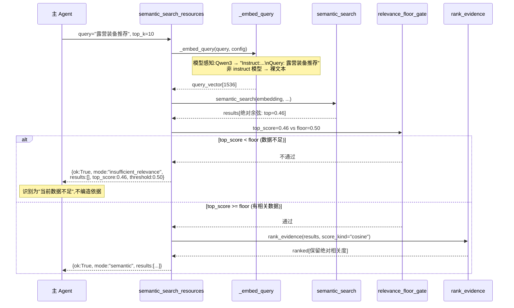

# 设计文档:检索相关性根本性修复 (retrieval-relevance-overhaul)

## Overview

小红书内容智能体的语义检索 (`semantic_search_resources`) 当前存在相关性失真:对语料中不存在的查询(如"露营装备推荐")仍会返回最近邻,并因排序层归一化把弱相关结果(余弦 0.46)抬升成 `relevance=1.0`、最终分 0.80,最终以"虚高分的创作依据"形式呈现给主 agent。这违背系统"数据不足要明说、绝不编造"的核心原则。

本次修复在检索质量的三个层面做根因修正,均为查询端与排序逻辑变更,**不涉及文档端重嵌、不改 schema(仍 1536 维)、不动 active 索引**:

1. **嵌入层(查询指令前缀)**:Qwen3-Embedding 是非对称检索模型,查询端需指令前缀 (`Instruct: ...\nQuery: <q>`)。当前 `_embed_query` 发送裸文本,导致区分度不足。修复为模型感知地在查询端注入指令前缀,文档端保持裸文本不变。
2. **排序层(去候选集内归一化)**:`rank_evidence` 当前用 `relevance = score / max_raw_score` 抹掉了绝对相关度。修复为对语义(余弦)结果直接使用绝对相关度;全文 (BM25) 结果因无固定上界仍走候选集内归一化,二者口径分离。
3. **闸门层(绝对相关度下限)**:新增绝对相关度阈值闸门。语义检索 top 绝对余弦低于阈值时,返回明确的"数据不足/低相关"态,而非把弱相关结果当依据,兑现反编造原则。

遵循项目铁律:从根因改,不打补丁、不加兼容层,相关测试一并重写。

---

# 第一部分:高层设计 (High-Level Design)

## Architecture

组件改动总览:

```mermaid
graph TD
    A[semantic_search_resources tool] -->|query text| B[_embed_query 查询端]
    B -->|模型感知注入指令前缀| C[Embedding Provider]
    C -->|query vector 1536d| D[semantic_search]
    D -->|absolute cosine rows| E{relevance floor gate<br/>绝对相关度闸门}
    E -->|top >= 阈值| F[rank_evidence<br/>score_kind=cosine 绝对相关度]
    E -->|top < 阈值| G[insufficient_relevance 返回态<br/>results=[]]
    F --> H[ok=True mode=semantic]

    A -.语义不可用基础设施降级.-> I[_fulltext_fallback]
    I --> J[search_resources Meili BM25]
    J -->|bm25 rows| K[rank_evidence<br/>score_kind=bm25 候选集内归一化]
    K --> L[ok=True mode=keyword_fallback]

    style E fill:#ffe0b2
    style G fill:#ffcdd2
    style B fill:#c8e6c9
    style F fill:#bbdefb
```

改动的组件与职责:

| 组件 | 文件 | 改动性质 | 说明 |
|------|------|----------|------|
| 查询端嵌入 | `data_foundation/tools.py::_embed_query` | 修改 | 模型感知注入查询指令前缀 |
| 嵌入配置 | `data_foundation/processors/embedding.py` | **不变(字段)** | `EmbeddingProviderConfig` 不新增字段;`embedding_config_from_snapshot` 保持纯快照函数,不计算检索期策略 |
| 配置快照 | `data_foundation/config.py` | 修改 | 新增 `XHS_EMBEDDING_QUERY_INSTRUCTION`/`XHS_EMBEDDING_RELEVANCE_FLOOR` 配置键 + `_model_aware_query_instruction` + 当前值读取器 |
| 文档端嵌入 | `data_foundation/processors/embedding.py::EmbeddingProcessor._embed` | **不变** | 保持裸文本(非对称设置) |
| 相关度闸门 | `data_foundation/tools.py::semantic_search_resources` | 修改 | 新增绝对相关度下限判断与"数据不足"返回态 |
| 排序去归一化 | `data_foundation/search_ranker.py::rank_evidence` | 修改 | 增加**必填** `score_kind` 参数,余弦走绝对、BM25 走归一化;调整权重 |
| 阈值/权重常量 | `data_foundation/search_ranker.py` | 新增 | 集中定义权重常量与默认阈值 `DEFAULT_RELEVANCE_FLOOR` |
| 全文检索 BM25 入排序点 | `data_foundation/tools.py::search_resources` | 修改 | 其内部 `rank_evidence` 调用显式传 `score_kind="bm25"`;并验证传入结果带有效 BM25 分数(真实 BM25 入排序点,非 `_fulltext_fallback` 包装层) |
| 提示词消费方 | `prompts.py`、`.agents/skills/topic-content/SKILL.md`、`knowledge-atom-retriever` 子代理提示词 | 修改 | 解读新增 `insufficient_relevance` 返回态:明说"数据不足"、不编造、不擅自降级 |

## 数据流变化对比

**修复前**:`query → 裸文本 embedding → semantic_rows(绝对余弦) → rank_evidence(候选集内归一化,弱相关被抬成 1.0) → 总返回结果`。无相关度下限,无关查询返回虚高分。

**修复后**:`query → 模型感知指令前缀 embedding(区分度提升) → semantic_rows(绝对余弦) → 闸门检查 top 绝对余弦 → ≥阈值:rank_evidence 保留绝对相关度 → 返回; <阈值:insufficient_relevance 空结果态`。

## 主流程时序图



## 分数口径分离(关键设计约束)

两条检索路径的分数语义不同,**绝不可套用同一阈值或同一归一化方式**:

| 路径 | 引擎 | 分数 | 范围 | 进入 rank_evidence 方式 | 受闸门约束 |
|------|------|------|------|------------------------|-----------|
| 语义检索 | pgvector | 余弦相似度 `1 - (embedding <=> vector)` | ≈ 0~1 (绝对) | `score_kind="cosine"`,直接用绝对值 | **是**,top < floor → 数据不足 |
| 全文降级 | Meilisearch | BM25 类分数 | 无固定上界 | `score_kind="bm25"`,候选集内归一化 | **否**,BM25 无可比绝对相关度 |

闸门只作用于语义(余弦)路径。全文降级是基础设施不可用时的兜底,其 BM25 分数没有可比的绝对相关度,因此不引入绝对下限(避免把 BM25 分数当余弦套同一阈值),仍保留候选集内归一化用于内部排序。

---

# 第二部分:低层设计 (Low-Level Design)

## 阈值与权重常量

集中定义于 `data_foundation/search_ranker.py`:

```python
# 绝对相关度下限闸门(仅作用于语义/余弦路径)
# 经验依据(生产实测,租户 default,Qwen3-Embedding-4B):
#   - 相关查询"护肤"(语料内)加前缀后 top 余弦 ≈ 0.65
#   - 无关查询"露营装备推荐"(语料外)加前缀后 top 余弦 ≈ 0.46
# 默认阈值取 0.50,落在 0.46(应拒) 与 0.65(应纳) 之间。
#
# ⚠️ 标定口径警示:上述 0.46/0.65 是用标定期的临时**英文**指令前缀测得,
# 而上线默认模板为**中文**(见 _DEFAULT_QUERY_INSTRUCTION),前缀文本不同会
# 改变查询向量与余弦分布。故 0.50 是初值,必须在最终中文模板下、用多组真实查询
# 在生产语料上重新标定(见 Requirements 3.7);且阈值可经配置覆盖(见下)。
DEFAULT_RELEVANCE_FLOOR: float = 0.50

# 阈值可经配置键 XHS_EMBEDDING_RELEVANCE_FLOOR 覆盖(归属 XHS_EMBEDDING_* 配置族,
# 配置中心热重载),由 Embedding_Config 解析为 EmbeddingProviderConfig.relevance_floor;
# 未配置时回退到 DEFAULT_RELEVANCE_FLOOR。

# rank_evidence 最终加权配比。
# 修复后 relevance 承载真实绝对相关度信号(且闸门已滤掉无关项),故提高其权重。
WEIGHT_RELEVANCE: float = 0.70   # 原 0.60
WEIGHT_FRESHNESS: float = 0.15   # 原 0.20
WEIGHT_TYPE: float = 0.10        # 原 0.10(不变)
WEIGHT_PERFORMANCE: float = 0.05 # 原 0.10
# 约束:四者之和 == 1.0
```

> 权重配比为可调决策项。提升 relevance 权重的理由:去归一化后 relevance 是真实绝对余弦,是"是否相关"的最强信号;闸门已在上游滤除无关项,排序阶段应更突出相关度本身,弱化时效/表现对低相关项的"救场"。

## 查询指令前缀配置

新增配置键(归属 `XHS_EMBEDDING_*` 业务配置族,支持配置中心热重载):

```python
# config.py 中 EMBEDDING_CONFIG_KEYS 追加
"XHS_EMBEDDING_QUERY_INSTRUCTION"  # 可选;查询端指令模板,含 {query} 占位符
```

模型感知默认值(当配置未显式设置时):

```python
# 仅对已知的非对称 instruct embedding 模型启用默认指令前缀。
# 命中:模型名包含 "qwen3-embedding"(大小写不敏感)。
# 未命中:返回 None,查询端发送裸文本(对任意 provider 不硬套)。
_DEFAULT_QUERY_INSTRUCTION = (
    "Instruct: 给定一个内容创作检索查询,找出与之相关的小红书素材\nQuery: {query}"
)

def _model_aware_query_instruction(model: str, explicit: str | None) -> str | None:
    if explicit:                      # 管理员显式配置优先
        return explicit
    if "qwen3-embedding" in model.lower():
        return _DEFAULT_QUERY_INSTRUCTION
    return None                       # 其他模型:裸文本,不套指令
```

约束:
- 指令前缀**只在查询端**注入。文档端 (`EmbeddingProcessor._embed`) 不读取 `query_instruction`,保持裸文本(非对称设置)。
- 指令模板必须含 `{query}` 占位符;实际查询通过 `template.format(query=...)` 注入。
- 对非 Qwen3 类模型默认不套(对任意 provider 不硬套),保证不破坏其他 provider 的对称检索语义。

## Components and Interfaces

本节定义受影响组件的接口契约。核心类型与返回契约见 Data Models。

### Component 1: `_embed_query`(查询端嵌入)

**Purpose**: 把查询文本送 provider 取向量,按传入的指令模板注入前缀。

**Responsibilities**:
- 接受调用方解析好的 `query_instruction` 参数(由 `semantic_search_resources` 从当前配置 + active index 模型名解析);非空时以 `query_instruction.format(query=query)` 作为发送文本,否则发送裸文本。
- 校验返回 1536 维有限向量,异常映射为 `EmbeddingSearchUnavailable`。
- 不自行读取配置决定指令(避免历史回放污染);指令由查询路径注入。

### Component 2: `rank_evidence`(证据排序)

**Purpose**: 对候选结果加权排序、去重、截断。

**Responsibilities**:
- 依 `score_kind` 区分 relevance 口径:`cosine` 用绝对值(夹紧 0~1),`bm25` 用候选集内归一化。
- 按 `WEIGHT_*` 常量加权,降序排序,标题模糊去重 (>0.90),截断到 `limit`。

### Component 3: `semantic_search_resources`(语义检索工具)

**Purpose**: 编排嵌入、检索、闸门、排序,产出带 `mode` 的结构化返回。

**Responsibilities**:
- 基础设施不可用 → `keyword_fallback`。
- 语义成功且 top 绝对余弦 < 阈值 → `insufficient_relevance`(空结果)。
- 语义成功且 top 绝对余弦 >= 阈值 → `semantic`(排序结果)。

## Data Models

### EmbeddingProviderConfig(**不新增字段**)

```python
@dataclass(frozen=True)
class EmbeddingProviderConfig:
    base_url: str
    api_key: str
    model: str
    config_version: str
    dimensions: int = 1536
    timeout_seconds: float = 30.0
    batch_size: int = 64
    state: str = "enabled"
    reason_code: str | None = None
```

**关键:`EmbeddingProviderConfig` 不新增 `query_instruction`/`relevance_floor` 字段。**
原因见下"关键约束"——这两者是检索期策略,必须从**当前**配置解析;而本 config 在查询侧由
`_embedding_query_config_for_index` 经 `embedding_config_from_snapshot(历史快照)` 构造,
`embedding_config_from_snapshot` 是快照纯函数、读不到当前配置。若把字段挂这里,查询侧只会拿到
历史回放值(对早于本功能的 active index 即空值),与 Requirements 1.9/3.8 冲突。

### 关键约束:检索期策略在查询路径从当前配置解析(重要)

语义查询路径并存两个配置来源,职责分离:

| 来源 | 取自 | 提供 | 为何 |
|------|------|------|------|
| 历史回放 query_config | `_embedding_query_config_for_index(active_index)`(按 `config_version` 回放) | `model`、`dimensions`、`base_url`、`api_key` | 查询向量必须与文档向量**口径可比** |
| 当前配置 | `runtime_embedding_snapshot()` / 当前配置值 | `query_instruction`、`relevance_floor` | 检索期策略,**不随索引历史回放** |

- **`query_instruction`** 在 `semantic_search_resources` 解析:
  `query_instruction = _model_aware_query_instruction(model=query_config.model, explicit=当前 XHS_EMBEDDING_QUERY_INSTRUCTION)`。
  模型名取 active index(历史)以正确判定 Qwen3;显式覆盖取**当前**配置。解析结果作为参数传入 `_embed_query`。
  → 即便 active index 的 `config_version` 早于本功能,Qwen3 仍命中模型感知默认前缀。
- **`relevance_floor`** 在闸门处由 `current_relevance_floor()` 从当前配置解析(`XHS_EMBEDDING_RELEVANCE_FLOOR` 或 `DEFAULT_RELEVANCE_FLOOR`)。
- **`embedding_config_from_snapshot` 保持纯函数、不读当前配置、不计算这两者**;文档端路径完全不受影响(仍裸文本)。

`embedding_config_from_snapshot` 保持不变(纯快照函数,不计算 `query_instruction`/`relevance_floor`、不读当前配置);检索期策略由查询路径解析。

### semantic_search_resources 返回契约

工具返回新增一个明确的"数据不足/低相关"返回态,供主 agent / 前端识别:

```python
# 1) 正常语义命中(top 绝对余弦 >= 阈值)
{"ok": True, "mode": "semantic", "results": [...]}

# 2) 新增:语义可用但 top 绝对相关度低于阈值(数据不足)
{
    "ok": True,
    "mode": "insufficient_relevance",   # 新增 mode
    "results": [],                       # 不返回弱相关结果(反编造)
    "top_score": 0.46,                   # 实测 top 绝对余弦,便于诊断/前端提示
    "threshold": 0.50,                   # 当前阈值
}

# 3) 基础设施降级(语义不可用):沿用既有 keyword_fallback,不受闸门影响
{"ok": True, "mode": "keyword_fallback", "fallback_reason": "...", "results": [...]}
```

`mode` 取值集合从 `{semantic, keyword_fallback}` 扩展为 `{semantic, keyword_fallback, insufficient_relevance}`。三者互斥语义:
- `semantic`:有相关数据,返回排序结果。
- `insufficient_relevance`:语义检索正常工作,但库内无足够相关内容 → 明确"数据不足",**不降级到全文**(BM25 无可比绝对相关度,降级会重新引入误命中)。
- `keyword_fallback`:语义基础设施不可用(无索引、provider 异常等)的兜底。

## 关键函数签名与形式化规格

### 函数 1:`_embed_query`(查询端注入指令前缀)

```python
def _embed_query(query: str, *, config: EmbeddingProviderConfig, query_instruction: str | None) -> list[float]:
    ...
```

**前置条件 (Preconditions):**
- `query` 为非空字符串(空查询在工具层已被 `_fulltext_fallback("EMPTY_QUERY")` 拦截,不会到达此处)。
- `config.state == "enabled"`,`config.dimensions == 1536`。
- `query_instruction` 由调用方从当前配置 + active index 模型名解析后传入(可能为 None)。

**后置条件 (Postconditions):**
- 当 `query_instruction is not None`:发送给 provider 的文本为 `query_instruction.format(query=query)`。
- 当 `query_instruction is None`:发送给 provider 的文本为原始 `query`(裸文本)。
- 返回 1536 维有限浮点向量;provider 401/403 → 抛 `EmbeddingSearchUnavailable("EMBEDDING_QUERY_UNAUTHORIZED")`。
- 不修改 `query` 入参,不产生其他副作用。

**循环不变式:** N/A(无循环)。

### 函数 2:`rank_evidence`(去归一化 + 口径分离)

```python
def rank_evidence(
    tenant_id: str,
    results: list[dict[str, Any]],
    performance_data: dict[str, list[dict[str, Any]]],
    limit: int = 10,
    *,
    score_kind: str,   # 必填,无默认:"cosine" | "bm25"(强制每个调用点显式声明口径,杜绝漏传静默走 cosine)
) -> list[dict[str, Any]]:
    ...
```

**前置条件:**
- `score_kind in {"cosine", "bm25"}`。
- 当 `score_kind == "cosine"`:每个 `item["score"]` 是绝对余弦相似度(≈ 0~1)。
- 当 `score_kind == "bm25"`:每个 `item["score"]` 是 BM25 类分数(无固定上界,≥ 0)。

**后置条件:**
- 当 `score_kind == "cosine"`:`relevance == clamp(item["score"], 0.0, 1.0)`,**不做候选集内归一化**(绝对相关度信号被保留)。
- 当 `score_kind == "bm25"`:`relevance == item["score"] / max_raw_score`(候选集内归一化,保留既有行为)。
- 最终分 `final == WEIGHT_RELEVANCE*relevance + WEIGHT_FRESHNESS*freshness + WEIGHT_TYPE*type_weight + WEIGHT_PERFORMANCE*performance`。
- 结果按 `final` 降序;标题模糊去重 (ratio > 0.90);截断到 `limit`。
- `rank_signals.relevance` 反映该路径下的真实 relevance 口径。

**循环不变式:**
- 去重循环:`final_results` 中任意两条标题相似度 ≤ 0.90。
- 遍历过程中已处理项的 relevance 计算口径恒等于入参 `score_kind`。

### 函数 3:`semantic_search_resources`(闸门判定)

```python
@tool
def semantic_search_resources(query: str, top_k: int = 10, config: RunnableConfig | None = None) -> dict[str, Any]:
    ...
```

**前置条件:**
- 已通过 `actor_from_config` 取得身份;空查询走 `_fulltext_fallback("EMPTY_QUERY")`。

**后置条件:**
- 若无 active 索引或 provider 异常 → `mode == "keyword_fallback"`(既有行为不变)。
- 若语义检索成功且 `max(绝对余弦 over results) >= relevance_floor`(`relevance_floor` 来自配置或 `DEFAULT_RELEVANCE_FLOOR`)→ `mode == "semantic"`,`results` 为 `rank_evidence(..., score_kind="cosine")` 结果。
- 若语义检索成功但 `top 绝对余弦 < relevance_floor`(含 `results` 为空)→ `mode == "insufficient_relevance"`,`results == []`,携带 `top_score` 与 `threshold`。
- 闸门基于 `semantic_search` 返回的**原始绝对余弦**判定,在 `rank_evidence` 加权**之前**进行。

**循环不变式:** N/A(闸门为单次聚合判断 `max` over results)。

## 算法伪代码

### 闸门判定主流程

```python
```python
# semantic_search_resources 内:
active_index = repo.active_embedding_index(default_tenant_id())   # 现有逻辑
query_config = _embedding_query_config_for_index(active_index)    # 历史回放:model/dims/key(向量可比)

# --- 检索期策略:从当前配置解析(不随历史回放)---
# query_instruction:模型名取 active index(判定 Qwen3),显式覆盖取当前配置
query_instruction = _model_aware_query_instruction(
    model=query_config.model,
    explicit=current_query_instruction(),   # 读当前 XHS_EMBEDDING_QUERY_INSTRUCTION
)
embedding = _embed_query(query, config=query_config, query_instruction=query_instruction)
results = semantic_search(repo, ..., embedding=embedding, top_k=top_k * 5)

# --- 绝对相关度闸门(在 rank_evidence 之前,基于原始绝对余弦)---
# 阈值同样取**当前配置**,不随 active index 的 config_version 历史回放。
floor = current_relevance_floor()  # 来自当前 XHS_EMBEDDING_RELEVANCE_FLOOR 或 DEFAULT_RELEVANCE_FLOOR
top_score = max((r.score for r in results), default=0.0)
if top_score < floor:
    # 数据不足:明确告知,不返回弱相关结果,不降级到全文
    return {
        "ok": True,
        "mode": "insufficient_relevance",
        "results": [],
        "top_score": round(top_score, 4),
        "threshold": floor,
    }
# --- 通过闸门:正常排序(保留绝对相关度)---
raw_results = _search_payload(results)
ranked = rank_evidence(
    tenant_id=default_tenant_id(),
    results=raw_results,
    performance_data=perf_data,
    limit=top_k,
    score_kind="cosine",
)
return {"ok": True, "mode": "semantic", "results": ranked}
```

### rank_evidence relevance 口径分支

```python
def _relevance_score(item, score_kind, max_raw_score):
    raw = float(item.get("score") or 0.0)
    if score_kind == "cosine":
        # 绝对相关度,夹紧到 [0, 1],不做候选集内归一化
        return min(max(raw, 0.0), 1.0)
    else:  # bm25:无固定上界,候选集内归一化
        return raw / max_raw_score
```

### _embed_query 指令注入

```python
def _embed_query(query, *, config, query_instruction):
    text = query
    if query_instruction:
        text = query_instruction.format(query=query)
    response = httpx.post(
        config.base_url.rstrip("/") + "/embeddings",
        headers={"Authorization": f"Bearer {config.api_key}"},
        json={"model": config.model, "input": [text], "dimensions": config.dimensions},
        timeout=config.timeout_seconds,
    )
    ...  # 校验与返回逻辑不变
```

## Example Usage

```python
# 例 1:语料内相关查询 → 正常语义命中
result = semantic_search_resources.func("护肤", top_k=10, config=cfg)
# {"ok": True, "mode": "semantic", "results": [{"resource_id": ..., "score": 0.78, ...}, ...]}

# 例 2:语料外无关查询 → 数据不足态(修复核心)
result = semantic_search_resources.func("露营装备推荐", top_k=10, config=cfg)
# {"ok": True, "mode": "insufficient_relevance", "results": [],
#  "top_score": 0.46, "threshold": 0.50}
# 主 agent 据此判定"当前数据不足",不把弱相关项当创作依据

# 例 3:语义基础设施不可用 → 全文降级(不受闸门影响)
result = semantic_search_resources.func("护肤", top_k=10, config=cfg)
# {"ok": True, "mode": "keyword_fallback", "fallback_reason": "NO_ACTIVE_EMBEDDING_INDEX", "results": [...]}
```

## Correctness Properties

### Property 1: 数据不足必明说
∀ 查询 q,若 `semantic_search` 成功且其结果集 top 绝对余弦 < `relevance_floor`(配置值或 `DEFAULT_RELEVANCE_FLOOR`),则返回 `mode == "insufficient_relevance"` 且 `results == []`。(反编造原则)

**Validates: Requirements 3.2, 3.3, 3.5**

### Property 2: 绝对相关度不被抹除
∀ 语义结果,`rank_evidence(score_kind="cosine")` 的 `rank_signals.relevance == clamp(原始绝对余弦, 0, 1)`,不随候选集最大值变化。

**Validates: Requirements 2.2, 2.4**

### Property 3: 口径隔离
全文路径 (`score_kind="bm25"`) 不被施加绝对相关度下限;语义路径施加。BM25 分数永不与 `relevance_floor` 比较。

**Validates: Requirements 2.3, 4.6**

### Property 4: 查询端指令模型感知
当且仅当 `query_instruction` 非空时查询文本被加前缀;文档端嵌入永远是裸文本。

**Validates: Requirements 1.1, 1.2, 1.3**

### Property 5: 非对称不污染对称模型
对非 Qwen3 类模型(无显式配置),`query_instruction is None`,查询端发送裸文本。

**Validates: Requirements 1.5**

### Property 6: 降级语义保持
基础设施不可用仍返回 `keyword_fallback`,不被新闸门误判为 `insufficient_relevance`。

**Validates: Requirements 4.1, 4.6**

### Property 7: 提示词消费方解读新返回态
对 `mode == "insufficient_relevance"`,Prompt_Consumers(主控提示词、`topic-content` SKILL、`knowledge-atom-retriever`)指示 agent 明说"当前数据不足"、不编造、不擅自降级到关键词凑依据。

**Validates: Requirements 7.1, 7.2, 7.3, 7.4**

### Property 8: 检索期策略取当前配置,不随历史回放
`query_instruction` 与 `relevance_floor` 均由**当前**配置 + Active_Index 模型名解析,不取自随 `config_version` 回放的历史快照。故对早于本功能的 Active_Index,Qwen3 查询仍加前缀、闸门仍生效。

**Validates: Requirements 1.9, 3.8**

### Known Limitation: BM25 降级路径不设闸门
"数据不足必明说"保证仅在 Cosine_Path(语义可用)成立。当语义基础设施不可用而走 BM25_Path 时,不施加绝对相关度闸门(BM25 无可比绝对相关度),弱相关结果仍可能出现。此为有意权衡,需在需求中显式记录(Requirements 4.7),不作为缺陷。

_Validates: Requirements 4.1, 4.6_

## Error Handling

| 场景 | 条件 | 响应 |
|------|------|------|
| 空查询 | `query` 为空/空白 | `keyword_fallback` (`fallback_reason="EMPTY_QUERY"`),不送 provider |
| 无 active 索引 | `active_embedding_index` 为 None | `keyword_fallback` (`NO_ACTIVE_EMBEDDING_INDEX`) |
| provider 鉴权失败 | 401/403 | `keyword_fallback` (`EMBEDDING_QUERY_UNAUTHORIZED`) |
| provider 网络异常 | httpx 5xx/超时/拒连 | `keyword_fallback` (`EMBEDDING_QUERY_HTTP_ERROR: ...`) |
| 向量校验失败 | 维度不符/含 NaN | `keyword_fallback` (`EMBEDDING_QUERY_INVALID_VECTOR: ...`) |
| **低相关(新增)** | 语义成功但 top 绝对余弦 < 阈值 | `insufficient_relevance`,`results=[]`,携 `top_score`/`threshold` |
| 指令模板缺占位符 | `query_instruction` 不含 `{query}` | 配置层校验拒绝;`format` 不报错时按原样发送(模板自负) |

关键区分:`insufficient_relevance` 与 `keyword_fallback` 语义不同——前者是"系统正常但库内无相关数据",后者是"语义检索能力不可用"。二者都不把弱相关结果伪装成依据。

## Testing Strategy

### 单元测试(重写,不做兼容)

按"根本性修复不做兼容"重写以下测试文件:

- **`tests/data_foundation/test_search_ranker.py`**(重写)
  - 删除 `test_rank_evidence_sorting_and_deduplication` 中 `relevance == 1.0`(0.9/0.9 归一化)的断言。
  - 新增:`score_kind="cosine"` 时 relevance 等于绝对余弦(如 score=0.46 → relevance≈0.46,非 1.0)。
  - 新增:`score_kind="bm25"` 时保留候选集内归一化行为。
  - 更新权重断言为新配比 (0.70/0.15/0.10/0.05)。
  - 保留:排序降序、标题模糊去重、freshness/performance 计算。

- **`tests/data_foundation/test_search_graph_tools.py`**(重写相关用例)
  - `test_embed_query_sends_requested_dimensions`:断言 Qwen3 模型时 `input` 文本被加指令前缀;非 Qwen3 模型时为裸文本。
  - 新增:`semantic_search_resources` 在 top 绝对余弦 < 阈值时返回 `mode=="insufficient_relevance"`、`results==[]`、携带 `top_score`/`threshold`。
  - 新增:top 绝对余弦 >= 阈值时返回 `mode=="semantic"` 且 relevance 为绝对值。
  - 保留并复核:`keyword_fallback` 各降级分支不受闸门影响。

- **`tests/data_foundation`**(config / embedding 相关)
  - 新增 `XHS_EMBEDDING_QUERY_INSTRUCTION` 配置解析与模型感知默认值用例。
  - 验证文档端 `EmbeddingProcessor._embed` 仍发送裸文本(不读取 `query_instruction`)。

### 属性测试方向(Property-Based)

- **库**:Hypothesis(Python)。
- 对随机 score 列表,验证 `score_kind="cosine"` 时输出 relevance == clamp(input, 0, 1)(与候选集其他项无关)。
- 对随机阈值上下边界,验证闸门判定的单调性:top_score 单调下降越过阈值时返回态从 `semantic` 切到 `insufficient_relevance`。

### 集成测试

- 真实 Postgres + pgvector:插入已知向量,构造 top 绝对余弦分别高于/低于阈值的两类查询,验证两种返回态。
- 沿用 `migrated_conn` fixture(无 `TEST_XHS_DATABASE_URL` 时跳过,按部署规则在 CI/专用 runner 补跑)。

## Dependencies

- 现有:`httpx`、`langchain_core`、`psycopg`、pgvector、Meilisearch。
- 新增:无新增运行时依赖。属性测试如启用需 `hypothesis`(dev 依赖,不进生产镜像)。

## 受影响文件清单

| 文件 | 改动 |
|------|------|
| `data_foundation/tools.py` | `_embed_query` 注入指令前缀;`semantic_search_resources` 闸门(阈值取自配置)+ `insufficient_relevance` 返回态、传 `score_kind="cosine"`;**`search_resources` 内部 `rank_evidence` 调用传 `score_kind="bm25"` 并验证 BM25 分数有效** |
| `data_foundation/search_ranker.py` | `rank_evidence` 增**必填** `score_kind`,去余弦归一化;新增权重常量 + `DEFAULT_RELEVANCE_FLOOR` |
| `data_foundation/search.py` | 复核 `semantic_search` 返回绝对余弦(已满足,预期无逻辑改动或仅注释) |
| `data_foundation/config.py` | 新增 `XHS_EMBEDDING_QUERY_INSTRUCTION` 与 `XHS_EMBEDDING_RELEVANCE_FLOOR` 配置键 + `_model_aware_query_instruction` + 当前值读取器(`current_query_instruction`/`current_relevance_floor`) |
| `data_foundation/processors/embedding.py` | **不新增 config 字段**;`embedding_config_from_snapshot` 保持不变(纯快照、不计算检索期策略);文档端 `_embed` 不变 |
| `prompts.py` | 主控提示词增加 `insufficient_relevance` 返回态解读 |
| `.agents/skills/topic-content/SKILL.md` | 工作流补充 `insufficient_relevance` 处理 |
| `subagents_executor.py` | `knowledge-atom-retriever` 子代理提示词识别 `insufficient_relevance` |
| `tests/data_foundation/test_search_ranker.py` | 重写 |
| `tests/data_foundation/test_search_graph_tools.py` | 重写相关用例 |

**Schema 不变**:仍 1536 维,不涉及 embedding 重嵌,不改 `schema.sql`、`resource_embeddings`、`embedding_indexes`。

## 部署边界(遵循 server-deployment-rules.md)

- **是否重建容器**:**需要**。本次为后端 Python 代码变更(`tools.py`/`search_ranker.py`/`config.py`/`processors/embedding.py`),按部署规则 §4.5 需 `langgraph build -t xhs-langgraph:latest` + `docker compose up -d --build`。
- **是否影响 active 索引 / 重嵌**:**不需要**。改动是纯查询端(指令前缀)+ 排序逻辑 + 工具返回契约,文档端嵌入与 `embedding_indexes`、`resource_embeddings` 不变,4549/4549 资源覆盖不受影响,无需重嵌。
- **配置项热重载**:`XHS_EMBEDDING_QUERY_INSTRUCTION` 归属 `XHS_EMBEDDING_*` 业务配置族,后续仅调该值时按规则 §4.5 注:不需重启容器(配置中心热重载)。但本次引入该键的代码路径首次上线仍需随上述代码变更一并重建。
- **验收**:本地 `uv run pytest tests/data_foundation -q`;服务器 `runtime_import_smoke.py` + `deploy_health_check.py`;数据底座 smoke 验证 `semantic_search_resources` 对语料内查询返回 `mode=semantic`、对语料外查询返回 `mode=insufficient_relevance`。
- **安全**:指令前缀模板不含密钥;`query_instruction` 不进日志/错误摘要/telemetry(随 `XHS_EMBEDDING_*` 脱敏规则)。
