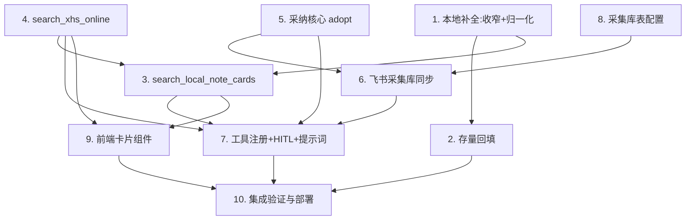

# Implementation Plan

## Overview

实现"搜索发现 + 选择性采集":本地补全(收窄过滤 + 回填)、发现专用本地检索(细致卡片,真问题A)、线上红狐检索(瞬态)、采纳核心(入库 + 效果指标)、飞书采集库同步(原文链接自然键去重,真问题C/D)、配置接入、前端细致卡片、集成部署。后端先行,前端与配置可并行,最后集成 smoke。

## Tasks

- [x] 1. 本地数据补全:收窄字段过滤 + 封面/原文链接归一化
  - 收窄 `tools/feishu_bitable.py` 的 `_EXCLUDE_COLUMN_KEYWORDS`:移除 `封面/链接/网址/域名/图片`,放行 `封面链接/原文链接/图片链接/视频链接` 等文本字段;保留过滤 `附件/提示词/二维码/头像/logo/trace/⚙️/设置`
  - 在落库路径把 `封面链接` 归一化为统一封面 URL 字段、从 `原文链接` markdown 提取 URL
  - 重写 `tests/test_feishu_bitable.py` 相关用例:放行封面链接/原文链接、仍过滤附件/提示词/系统列
  - _Requirements: 1.1, 1.2, 1.3_

- [x] 2. 存量本地记录回填
  - 扩展回填脚本 re-sync 现有 `feishu_base_record`(经已修好的 bot 同步链路)补齐放行字段,按 external_id 幂等
  - 验证回填后 `content_json.fields` 含封面链接/原文链接
  - _Requirements: 1.5_

- [x] 3. 发现专用本地检索工具 `search_local_note_cards`
  - 新建 `data_foundation/local_cards.py`:复用 Meili/语义召回拿 readable resource_id(租户 + 权限后置,沿用 over-fetch),hydrate `content_json.fields` 映射统一卡片形状(cover_url/note_url/互动/tags/author/author_fans/created_at)
  - 返回前按 `note_url` 内部去重;返回 `source="local"`
  - 断言并测试:`search_resources`/`semantic_search_resources`/`rank_evidence` 返回结构与 EvidencePackage 消费方**不变**(回归保护)
  - _Requirements: 1.4_

- [x] 4. 线上检索工具 `search_xhs_online`(红狐 API)
  - 新建 `tools/redfox_search.py`:`POST https://redfox.hk/story/api/xhs/search/search`,`X-API-KEY` 取自 `REDFOX_API_KEY`;入参 `{keyword,pageNum,pageSize,startDate,endDate,source}`,`startDate=today-days`
  - 映射统一卡片形状(摘要截断不含全文),附 `related_searches`;返回 `already_local`(比对本地 note_url 集合)
  - 降级:超时/非 2000/网络异常 → `{ok:False, reason}`,不抛错
  - 单元测试(mock 响应 + 降级 + already_local)与 hypothesis 属性测试(任意响应形状不抛错、数值非负)
  - _Requirements: 2.1, 2.2, 2.3, 2.4, 2.5, 2.6_

- [x] 5. 采纳核心 `adopt_online_notes_resource` + agent 工具
  - 新建 `data_foundation/online_notes.py`:`upsert_resource(type="xhs_online_note", content_json=全字段+note_url)`,mapping `system="redfox", external_id=note_id` 幂等,走 outbox
  - 接效果指标:互动数 → `save_performance_metric_resource`(§8,幂等),建 `measured_by` 边
  - 逐条 try,单条失败计入 errors 不影响其余;数据库先成功
  - 注册 `@tool adopt_online_notes`,返回每条 `{note_id, adopted, resource_id, feishu_synced}`
  - 单元 + hypothesis:同 note_id 采纳 2 次 = 1 资源 1 边;飞书失败不回滚库
  - _Requirements: 4.2, 4.3, 4.4, 4.5_

- [x] 6. 飞书爆款采集库同步工具 `sync_online_note_to_feishu`(自然键去重)
  - 在 `tools/feishu_actions.py` 新增工具:目标表 `FEISHU_BITABLE_COLLECT_TABLE_ID`(默认 `tbl24vSVeLvz45ig`),列映射(标题/正文/点赞/收藏/评论/转发/博主/发布时间/封面链接/原文链接/话题标签/采集平台)
  - 去重:`base +record-search` 按 `原文链接` 查存量 → 命中 `+record-update`,未命中 `+record-create` 后回写飞书 record_id 到 Postgres mapping(`system="feishu_collect"`)
  - 用户 UAT 身份(非 bot);失败保留库记录并报告
  - 单元测试:列映射、record-search 命中 update / 未命中 create + 回写、按 note_url 幂等
  - _Requirements: 5.1, 5.2, 5.3, 5.4_

- [x] 7. 工具注册 + HITL + 编排提示词
  - 注册 `search_local_note_cards`/`search_xhs_online`/`adopt_online_notes`;把 `adopt_online_notes`/`sync_online_note_to_feishu` 纳入 `interrupt_on`
  - `prompts.py`:§6 检索第一步编排"本地+线上双路、线上瞬态、采纳才落库、UAT 写飞书 HITL";§5 加搜索卡片"AI 文本只留摘要"约定
  - 测试:工具集合含新工具;interrupt_on 覆盖飞书写
  - _Requirements: 3.4, 4.1, 4.6_

- [x] 8. 采集库表配置接入(明文)
  - `web/src/lib/server/config-store.ts` 白名单加 `FEISHU_BITABLE_COLLECT_TABLE_ID`
  - `web/src/components/thread/history/FeishuConfigPage.tsx` 增采集库表 id 配置项(默认占位 tbl24vSVeLvz45ig)
  - `.env`/docker-compose 注入 `REDFOX_API_KEY` 与 `FEISHU_BITABLE_COLLECT_TABLE_ID`
  - 重写相关 allowlist 测试
  - _Requirements: 5.5_

- [x] 9. 前端细致卡片组件 + 工具渲染注册
  - `web/src/lib/tool-display.ts`:为 `search_xhs_online`/`search_local_note_cards` 注册卡片渲染映射
  - 新建 `web/src/components/thread/messages/search-cards.tsx`:本地组 + 线上组分组、计数、skeleton-shimmer、hover 抬升;细致卡片(封面/标题/博主/互动 chips/标签 pills/来源徽章/线上三维评分/查看原文)
  - 线上卡:勾选框 + 「采纳收录」单按钮 + 顶部「全选/采纳选中(k)」;`already_local`/已采纳卡灰标「已收录」禁用;采纳点击经 `submitText` 回传精简 payload,并把回传消息渲染为简洁动作 chip
  - 跨源去重在合并展示层兜底(按 note_url),以工具层 `already_local` 为准
  - 前端测试:渲染、勾选 payload、already_local 禁用
  - _Requirements: 3.1, 3.2, 3.3, 3.5, 4.1, 6.1, 6.2_

- [x] 10. 集成验证与部署
  - 本地全测试通过(后端 + 前端)
  - commit → push → 服务器 pull → langgraph build → `docker compose up -d --build langgraph`(env 变更 up -d)
  - smoke(服务器):本地补全 re-sync 后封面链接入库;本地检索出细致卡片;线上检索 → 卡片 → 采纳 → 库 + 飞书(record-search 去重);效果指标接通;HITL 审批生效
  - _Requirements: 1.5, 2.1, 3.5, 4.4, 5.3_

## Task Dependency Graph



依赖说明:T1 是本地侧根(收窄过滤),T3 既依赖 T1(补全后字段)也依赖 T4(`already_local` 需线上+本地比对口径一致)。T5→T6 是采纳→飞书镜像链;T8(独立表配置)是 T6 的前置。T7 汇聚后端工具注册;T9 前端依赖两个检索工具的返回形状;T10 集成所有。

```json
{
  "waves": [
    { "wave": 1, "tasks": ["1", "4", "5", "8"] },
    { "wave": 2, "tasks": ["2", "3", "6"] },
    { "wave": 3, "tasks": ["7", "9"] },
    { "wave": 4, "tasks": ["10"] }
  ]
}
```

## Notes

- 铁律:根本性修复不打补丁,相关测试一并重写;明文配置;中文为主场景;飞书写经 Agent tool + HITL(不经 frontend business API)。
- 不动 `rank_evidence`/EvidencePackage 证据链(任务 3 须有回归断言)。
- 范围外(下一步):用本地+线上数据出选题;泛词先推细分词;线上结果定时自动采集。
- 部署遵 `docs/deployment/server-deployment-rules.md`;env 变更只需 `up -d`,代码变更需 `langgraph build`。
