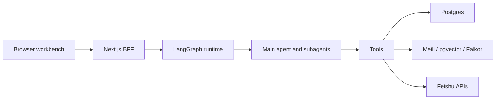
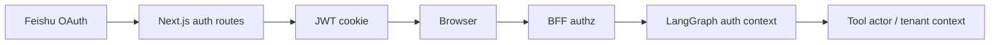
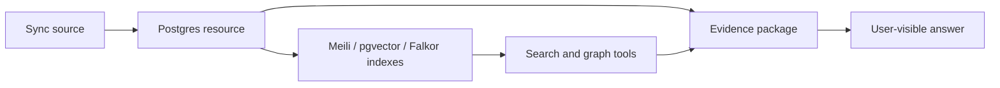
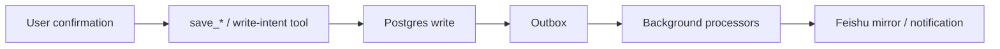
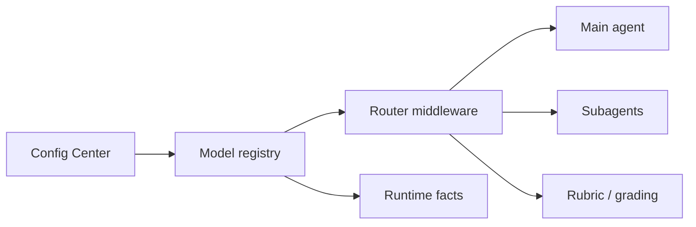
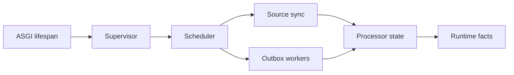

# Runtime Architecture Map

This document is the maintainer entry point for production runtime flow. It records the paths and constraints that are easy to lose when reading the code, old plans, README notes, and deployment files separately.

## System Roles

- Browser: authenticated creation workbench, chat UI, preview, runtime/config pages.
- Next.js BFF: same-origin API gateway, Feishu OAuth callback handler, JWT cookie issuer, admin authorization, internal runtime proxy.
- LangGraph service: graph runtime, DeepAgents assembly, model routing, tools, interrupts, and persisted thread execution.
- Postgres: business fact authority for resources, evidence, versions, config data, permissions, sync state, outbox, telemetry, and metrics.
- Redis: runtime dependency used by the deployment topology for supporting infrastructure.
- Meilisearch: keyword retrieval engine.
- pgvector: semantic retrieval path stored in Postgres.
- FalkorDB: graph retrieval engine.
- Feishu: collaboration mirror and action channel, not the authority for business facts.

## Request Flow

The browser calls the same-origin Next.js API. The BFF forwards graph requests and internal runtime requests with server-side authorization. LangGraph owns conversation execution and tool calls. Tools read/write authoritative business state through Postgres, query retrieval engines when needed, and treat Feishu as an external integration.

## Identity Flow

Feishu OAuth establishes the user session. Next.js issues and validates the JWT cookie. Admin and runtime pages must pass BFF authorization before internal data is read. Tool calls should receive actor and tenant context from the authenticated graph path, not from user-authored prompt text.

## Evidence Flow

Formal evidence must come from persisted resources. Online notes remain transient until adopted into the resource store. Search engines can rank, enrich, and retrieve, but the durable resource and evidence identifiers come from Postgres.

## Save Flow

Feishu mutations and external sends require human confirmation. The durable save happens in Postgres first. Outbox processors mirror or notify external systems afterward, so Feishu should never be treated as the source of truth for the content asset.

## Model Flow

Config Center is the runtime authority for editable model and integration configuration. The model registry loads active pool metadata from that authority. Router middleware selects models for the main agent, subagents, and rubric paths. Runtime facts should report model availability without exposing secrets.

## Background Flow

Background work starts from the ASGI lifespan supervisor. The scheduler discovers and runs sync and outbox processors. Processor state and backlog facts must be visible through runtime facts so operators can distinguish healthy, degraded, and blocked states.

## Constraints Not To Change Casually

- Keep `N_WORKERS=1` in the current production deployment unless a shared model registry authority, broadcast mechanism, and worker convergence check are implemented.
- Postgres is the business fact authority; Feishu is a collaboration mirror and action surface.
- Config Center is the authority for editable runtime config when config-center mode is enabled.
- Feishu write actions, external sends, and other side effects require human confirmation before execution.
- Formal evidence in user output must reference persisted resources, not transient web or prompt-only material.
- Online notes are not durable evidence until they are adopted into the resource store.
- Runtime and smoke checks must redact secrets such as API keys, JWT secrets, Feishu tokens, database passwords, and stored credentials.
- Search engine failures should be classified separately from total product failure when core chat, model routing, auth, and Postgres still work.

## Guard Tests And Files

- `tests/test_deploy_script.py`: deployment rules such as worker count and production topology expectations.
- `tests/test_config_center.py`: Config Center behavior and editable config authority.
- `tests/test_grounded_content_contract.py`: grounded content and evidence contracts.
- `tests/data_foundation/test_search_graph_tools.py`: retrieval and evidence package behavior.
- `tests/data_foundation/test_outbox_worker.py`: outbox processing expectations.
- `tests/data_foundation/test_runtime_facts.py`: runtime facts and module visibility.
- `web/tests/runtime-facts-route.test.ts`: BFF runtime facts forwarding and auth handling.
- `web/tests/runtime-facts-page.test.ts`: runtime facts UI formatting and leakage guardrails.

## Future Multi-Worker Path

The intended scale path is not to raise worker count first. Persist model registry version and active pool metadata to Postgres, broadcast config changes with Postgres notify, make each worker reload from the shared version, and expose per-worker registry versions in runtime facts. Admin saves should report success only when reload convergence is visible, or explicitly report partial convergence.
