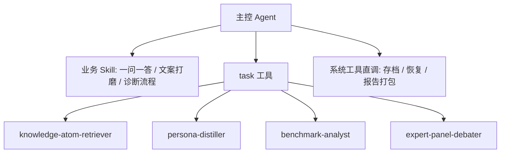

# 小红书智能体 Sub-agent 架构分层重构规格书

**设计日期**：2026-07-03
**状态**：已实现
**设计目标**：使用 DeepAgents 官方支持的 `SubAgent` / `create_deep_agent(subagents=...)` 扩展方式，把重检索、风格提炼、爆款对标、多专家诊断拆到隔离上下文中执行，主控只负责路由、交互和最终决策。

## 1. 拓扑

## 2. 分层决策

- `benchmark-analyst`：替代原 `xhs-benchmark` Skill 壳层，负责隔离精读同行与爆款素材，输出 `BenchmarkReport`。
- `expert-panel-debater`：替代原 `xhs-chatroom` Skill 壳层，负责隔离多角色诊断与共识输出，输出 `DebateVerdictReport`。
- `xhs-dbskill-upgrade`：删除，开发者审计逻辑沉淀为 `scripts/dbskill_audit.py`。
- `xhs-system`：保留为主控直调系统工具路径，不做子代理套壳。
- `xhs-content-system`：保留为内容工程化 Skill，不再作为对标分析入口。

## 3. 官方扩展边界

子代理配置只能使用 `deepagents.middleware.subagents.SubAgent` 的公开字段：

- `name`
- `description`
- `system_prompt`
- `tools`
- `model`
- `middleware`
- `response_format`

当前实现还依赖公开字段 `middleware` 挂载 `build_router_middleware(registry)`，保证模型与 key 的热加载一致性。不得使用 DeepAgents 私有 tracing context hook。

## 4. 子代理规格

### `benchmark-analyst`

职责：在隔离上下文中检索并精读对标素材、同行爆款和历史内容，提炼写作套路、心理触发器、排版风格和内容机会点。

工具：

- `semantic_search_resources`
- `search_resources`
- `get_resource`

输出契约：`BenchmarkReport`

- `core_patterns: list[str]`
- `common_triggers: list[str]`
- `layout_style: str`
- `content_gaps: str`

### `expert-panel-debater`

职责：在隔离上下文中围绕运营表现、选题和变现问题组织多角色诊断，给出专家观点和共识建议。

工具：

- `get_operations_data`
- `get_resource`
- `search_resources`

输出契约：`DebateVerdictReport`

- `debate_process_markdown: str`
- `panel_opinions: list[ExpertPanelOpinion]`
- `consensus_recommendation: str`

## 5. 主控路由

- 找同行、拆爆款、判断真对标：调用 `task` 委派 `benchmark-analyst`。
- 多角色讨论、奥派经济视角、商业决策辩论：调用 `task` 委派 `expert-panel-debater`。
- 存档、恢复、打包报告、工作台迁移：主控直接调用系统工具，不委派子代理。

## 6. 可观测性

DeepAgents 官方 `SubAgentMiddleware` 会把子代理名称写入子代理 run 的 `lc_agent_name` metadata。排查链路时按 `lc_agent_name=benchmark-analyst`、`lc_agent_name=expert-panel-debater` 等值过滤。

验收约束：

- 代码不得引用 DeepAgents 私有 tracing hook。
- 子代理名称必须稳定、唯一、可读。
- 测试必须验证子代理 spec 未越过 `SubAgent` 公开字段。

## 7. 验收

- `tests/test_subagents_refactoring.py` 验证四个子代理名称、输出契约、官方字段边界和文档私有 hook 禁用。
- `tests/test_agent_assembly.py` 验证主控装配四个执行型子代理。
- `tests/test_dbskill_alias_coverage.py`、`tests/test_storage_policy.py`、`tests/test_user_visible_skill_language.py` 验证删除 Skill 后没有残留业务路由。
- `scripts/runtime_import_smoke.py` 验证部署前核心运行时导入。
- `scripts/dbskill_audit.py` 验证退役 Skill 未回流。
